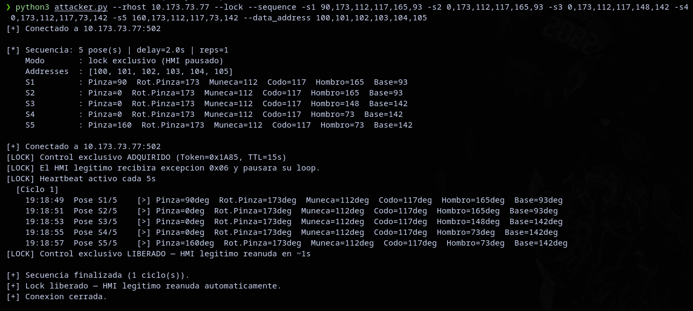
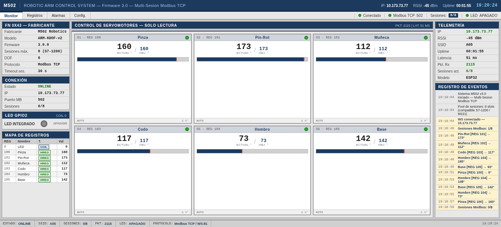

# CYBERSPAM-502 🏭

CYBERSPAM 502 es un proyecto que simula un entorno OT/IoT: un brazo robótico de 6 grados controlado por un ESP32 que actúa como un PLC utilizando el protocólo Modbus TCP.
El fin de este proyecto es demostrar las vulnerabilidades en redes OT: falta de control de acceso a Modbus TCP, influyendo en el control libre del brazo robótico por parte del atacante.

## Ataque

"Tras pivotar dentro de la red de una empresa de automatizacion, un atacante encontró un PLC ejecutando Modbus TCP sin autenticacion. Los administradores mantenian un brazo robotico que corria un loop infinito. El atacante utilizara Modbus TCP a su favor para ejecutar los movimientos del brazo como el quiera..."

El administrador ejecuta continuamente un loop en el cual mueve una caja de A hacia B:


En el dashboard (Puerto 80) se pueden ver los cambios en tiempo real:


El atacante utiliza LOCK (Ownsership) para poder ejecutar su secuencia de movimiento por encima del administrador. El LOCK (Ownership) responde a la siguiente pregunta, ¿Si estas personas quieren comunicarce con el brazo, entonces quien tiene prioridad?. En este escenario lo que se implemento es un mecanismo de control exclusivo inspirado en como PLCs industriales manejan el acceso recurrente.

```
SIN LOCK — bus compartido
_____________________________________________________
HMI Admin  --> escribe REG 100-105  ✓
Atacante   --> escribe REG 100-105  ✓
Resultado  : los movimientos se mezclan, el brazo enloquece

CON LOCK — control exclusivo
_____________________________________________________
Atacante   --> escribe REG 200 = 0xA5A5
ESP32      --> concede el lock al atacante
               token = 0x7F3A | TTL = 15s | owner = sesión #1

Atacante   --> escribe REG 100-105  ✓  (es el dueño)
HMI Admin  --> escribe REG 100-105  ✗  (recibe excepción 0x06)

Ctrl+C     --> atacante escribe REG 200 = 0x0000
ESP32      --> lock liberado
HMI Admin  --> reanuda automáticamente en ~1s

REGISTROS DE CONTROL (REG 200-203)
_____________________________________________________
REG 200  REG_LOCK_CMD    0xA5A5 = lock activo / 0x0000 = libre
REG 201  REG_LOCK_TOKEN  token aleatorio asignado por el ESP32
REG 202  REG_LOCK_TTL    segundos restantes antes de auto-release
REG 203  REG_LOCK_OWNER  ID de sesión TCP dueña del lock (0-7)

HEARTBEAT — por qué es necesario
_____________________________________________________
TTL = 15s -> si el atacante no renueva en 15s, el lock expira
Solución  -> hilo en background escribe 0xA5A5 cada 5s
             esto reinicia el TTL y mantiene el lock vivo
             mientras la secuencia del atacante corre
```



Los cambios pueden verse en tiempo real en el Dashboard:



## Mitigaciones contra ataques Modbus TCP

1. Segmentación de red:
Cualquier equipo en la red corporativa puede llegar directamente al PLC en el puerto 502 si no existe segmentacion de red. Con segmentación correcta, un firewall industrial separa la red OT de la red corporativa y solo el HMI autorizado puede alcanzar el PLC.

2. Firewall con Deep Packet Inspection
Un firewall industrial como Claroty, Dragos o Nozomi entiende el protocolo Modbus a nivel de función. Puede permitir FC 0x03 (lectura) desde cualquier IP, pero bloquear FC 0x06 y FC 0x10 (escritura) desde cualquier IP que no sea el HMI autorizado. El atacante puede ver el PLC pero no puede escribir en él.

3. Whitelist de IPs en el PLC
Algunos PLCs permiten configurar desde qué IPs tienen permiso de escritura. Las demás solo pueden leer o directamente no reciben respuesta. Es la mitigación más simple y no requiere hardware adicional.

4. Modbus Security TLS en puerto 802
Esta version añade cifrado TLS 1.2 y autenticación por certificados X.509. El problema es que muy pocos dispositivos lo soportan en la práctica.

5. IDS industrial 
Herramientas como Nozomi Networks aprenden el comportamiento normal del HMI: qué IP escribe, qué registros toca, con qué frecuencia. Cuando el atacante aparece desde una IP desconocida escribiendo los mismos registros a mayor frecuencia, la alerta se dispara aunque el protocolo Modbus no lo detecte por sí solo.
