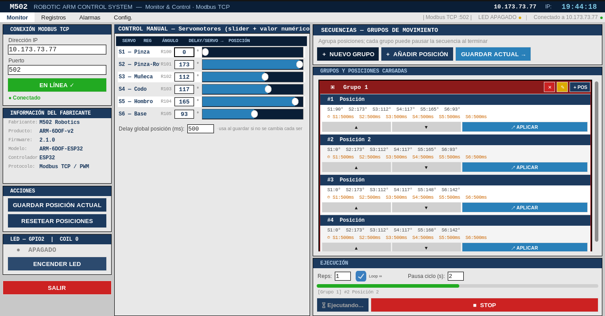
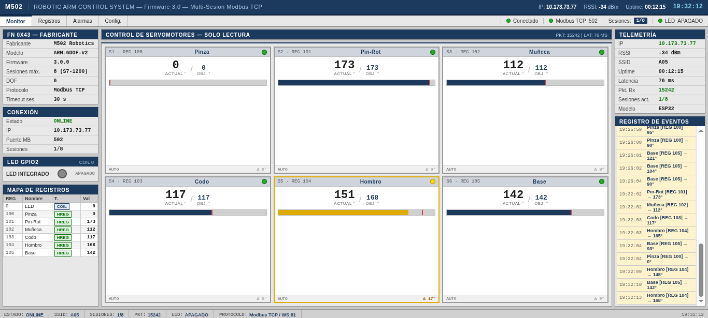

# CYBERSPAM-502 🏭

CYBERSPAM 502 es un proyecto que simula un entorno OT/IoT: un brazo robótico de 6 grados controlado por un ESP32 que actúa como un PLC utilizando el protocólo Modbus TCP.
El fin de este proyecto es demostrar las vulnerabilidades en redes OT: falta de control de acceso a Modbus TCP, influyendo en el control libre del brazo robótico por parte del atacante.

## Ataque

"Tras pivotar dentro de la red de una empresa de automatizacion, un atacante encontró un PLC ejecutando Modbus TCP sin autenticacion. Los administradores mantenian un brazo robotico que corria un loop infinito. El atacante utilizara Modbus TCP a su favor para ejecutar los movimientos del brazo como el quiera..."

El administrador ejecuta continuamente un loop en el cual mueve una caja de A hacia B:

En el dashboard (Puerto 80) se pueden ver los cambios en tiempo real:

